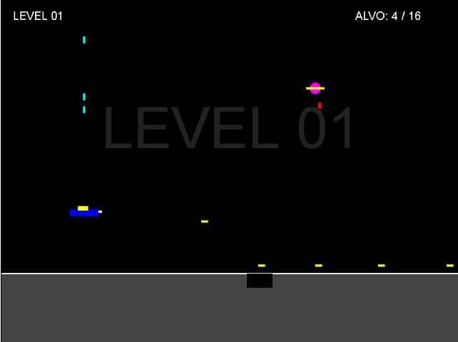

# Moon Patrol

Uma versão minimalista e moderna do clássico jogo **Moon Patrol** desenvolvida em **HTML5 e JavaScript Puro (ES6)**. O objetivo do jogador é guiar o carrinho lunar pela superfície da Lua ao longo de 5 níveis progressivos, saltando sobre crateras no solo e destruindo rochas espaciais com o canhão frontal e discos voadores com o canhão vertical.

Este projeto foi reestruturado com foco pedagógico para servir de introdução à lógica de programação de jogos e à Programação Orientada a Objetos (POO) para alunos iniciantes, oferecendo um paralelo direto com os conceitos usados em C# com XNA/MonoGame e seguindo a mesma arquitetura dos projetos [Plumet](https://github.com/FCA-GAMEDEV/plumet.git) e [Arkanoid](https://github.com/FCA-GAMEDEV/arkanoid.git).



---

## 🌐 Jogue Online (GitHub Pages)

A versão jogável deste projeto está disponível diretamente pelo navegador no GitHub Pages:
👉 **https://fca-gamedev.github.io/moonpatrol/**

---

## 🎮 Como Jogar / Controles

* **Iniciar Partida:** Pressione a tecla `Enter` no menu inicial.
* **Mover Carrinho:** Use as setas `Esquerda` (←) e `Direita` (→) do teclado.
* **Saltar:** Pressione a seta `Cima` (↑) ou a tecla `W` para saltar sobre crateras e rochas.
* **Tiro Duplo:** Pressione a barra de `Espaço` para disparar simultaneamente o canhão frontal e o canhão superior.
* **Pausar/Retomar:** Pressione a tecla `P` durante a partida.
* **Voltar ao Menu:** Pressione `Escape` nas telas de Congratulations (vitória) ou Game Over (derrota).

---

## 🚀 Como Executar o Projeto

Como o projeto utiliza **módulos nativos do JavaScript (ES6)** para manter o código limpo e organizado, os navegadores modernos bloqueiam o carregamento direto por motivos de segurança se você apenas der dois cliques no arquivo `index.html` (protocolo `file://`).

Para rodar o jogo localmente, você precisa usar um servidor local. Aqui estão as formas mais fáceis de fazer isso:

### Opção 1: VS Code (Recomendado para alunos)
1. Instale a extensão **Live Server** (por Ritwick Dey) no VS Code.
2. Abra a pasta do projeto no VS Code: `File > Open Folder`.
3. Abra o arquivo `index.html` e clique no botão **"Go Live"** no canto inferior direito da tela.

### Opção 2: Python (Terminal)
Abra o terminal na pasta do projeto e digite o comando correspondente à sua versão do Python:
```bash
python -m http.server 8000
# ou para Python 2: python -m SimpleHTTPServer 8000
```
Em seguida, abra o navegador e acesse: `http://localhost:8000`.

### Opção 3: NodeJS
Se você tiver o Node.js instalado, pode rodar o servidor direto no terminal usando:
```bash
npx http-server
```

---

## 🎓 Conceitos Didáticos Abordados no Código

Este repositório foi construído para servir de base em sala de aula, ensinando os seguintes fundamentos de desenvolvimento de jogos:

1. **Game Loop com Trava de 60 FPS:** 
   O ciclo contínuo de atualização (`update`) e desenho (`draw`) sincronizado via `requestAnimationFrame`, com lógica adicional de throttling de tempo para travar o jogo a exatamente 60 FPS. Isso garante uma física consistente mesmo em monitores de alta frequência (120Hz/144Hz).
2. **Programação Orientada a Objetos (POO):**
   * **Classes Base (Modelos/Abstratas):** [`GameObject`](./src/js/gameObject.js) (para entidades físicas) e [`Scene`](./src/js/scene.js) (para as fases e telas).
   * **Herança com `extends` e `super()`:** Como as entidades (`Player`, `Bullet`, `Obstacle`, `Crater`, `Rock`, `UFO`, `Bomb`) herdam propriedades físicas comuns (x, y, largura, altura) da classe base.
3. **Gerenciamento de Estados de Entrada (Input Polling):**
   Uso do objeto [`input.js`](./src/js/input.js) para rastrear teclas pressionadas de maneira similar ao `Keyboard.GetState()` do XNA, ensinando também a diferença entre detectar uma tecla "segurada" (`isKeyDown` - para movimentar o jogador) e um "toque único" (`isKeyJustPressed` - usado para pulo, disparo, transição de cenas e Pause).
4. **Detecção de Colisão AABB (Axis-Aligned Bounding Box):**
   Fórmula matemática em 2D para checar sobreposição de retângulos/caixas de colisão entre os tiros e rochas/OVNIs, bem como do carrinho contra crateras no solo e bombas alienígenas.
5. **Máquina de Estados Simples para Cenas:**
   Como o [`sceneManager.js`](./src/js/sceneManager.js) controla a transição fluida entre o menu inicial, a cena de jogo (com suporte a 5 níveis que aumentam de velocidade e quantidade de obstáculos), tela de game over e tela de vitória.
6. **Progressão de Dificuldade Automática:**
   Uso de fórmulas matemáticas simples para calcular dinamicamente a velocidade dos obstáculos (`speed = 4 + level`) e a quantidade necessária para passar de nível (`NUM_MAX = 8 * level + 8`).

---

## 📁 Estrutura de Pastas

```text
├── index.html                 # Página inicial e ponto de partida do DOM
├── screenshot.png             # Imagem ilustrativa do jogo
├── LICENSE                    # Licença do repositório
└── src/
    └── js/
        ├── main.js            # Ponto de entrada (Bootstrap) e gerenciador de 60 FPS
        ├── graphics.js        # Wrapper simples do contexto 2D do Canvas
        ├── input.js           # Gerenciador central de eventos de teclado
        ├── gameObject.js      # Classe base para objetos de jogo (física/posição)
        ├── player.js          # Entidade do carrinho lunar (herda de GameObject)
        ├── bullet.js          # Entidade de projétil frontal e vertical (herda de GameObject)
        ├── obstacle.js        # Classes Crater e Rock (herdam de GameObject)
        ├── obstacleManager.js # Gerador e gerenciador dos obstáculos na tela (dificuldade)
        ├── enemy.js           # Classes UFO e Bomb (herdam de GameObject)
        ├── enemyManager.js    # Gerenciador dos discos voadores e bombas
        ├── scene.js           # Classe base para definição de telas/cenas
        ├── sceneManager.js    # Gerenciador e máquina de estados das cenas
        ├── opening.js         # Cena do menu inicial (herda de Scene)
        ├── game.js            # Cena principal da partida (herda de Scene)
        ├── congratulations.js # Cena de vitória ao bater todos os níveis (herda de Scene)
        ├── gameOver.js        # Cena de derrota (herda de Scene)
        └── collisionManager.js# Gerenciador das regras físicas e colisões do jogo
```

---

## 📄 Licença

Este projeto está licenciado sob a licença [MIT](./LICENSE).
